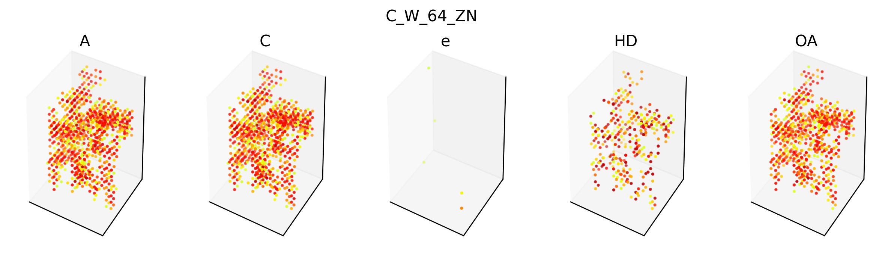

# Playground

Playing with the code and data of the following article ([repo](https://bitbucket.org/mkoohim/multichannel-cnn/src/master/)):

Koohi-Moghadam, Mohamad, et al. "Predicting disease-associated mutation of metal-binding sites in proteins using a deep learning approach." *Nature Machine Intelligence* (2019): 1-7.


Visualizations/results are shown in Jupyter Notebooks in the `notebook` folder.


## Spatial data overview

1. Label Distribution

    |  Negative  |  Positive  |  Total  |
    |:----------:|:----------:|:-------:|
    |    259     |     99     |   358   |
    
2. Channel statistics

    |  channel index  |  min value  |  max value  |  mean   |  variance  |
    |:---------------:|:-----------:|:-----------:|:-------:|:----------:|
    |        1        |   -0.939    |   400147    | 15005.3 | 1.3411e+09 |
    |        2        |   -1.056    |   400147    | 15005.3 | 1.3411e+09 |
    |        3        |   -47.955   |   45.892    | 0.5181  |   5.509    |
    |        4        |   -1.105    |   200555    | 3810.11 | 2.9298e+08 |
    |        5        |   -1.965    |   400010    | 10484.3 | 8.6604e+08 |

3. Channel statistics after standardization

    Since the amplitudes of channel 1, 2, 4, 5 are very large, we apply logarithm 
    function to reduce their scale. 

    |  channel index  |  min value  |  max value  |  mean  |  variance  |
    |:---------------:|:-----------:|:-----------:|:------:|:----------:|
    |        1        |      0      |      1      | 0.3762 |  0.086785  |
    |        2        |      0      |      1      | 0.3772 |  0.086166  |
    |        3        |      0      |      1      | 0.5165 | 0.0006255  |
    |        4        |      0      |      1      | 0.2038 |  0.057005  |
    |        5        |      0      |      1      | 0.3305 |  0.073888  |

4. Testing the data with simple ML algorithm (SVM)
    
    Run the spatial data with SVM using 4-fold cross validation.
    
    - Average AUC when using all 5 channels: 0.627
    - Average AUC of each channel:
        
        ```
        [0.65045072 0.65045072 0.5        0.65045072 0.65045072]
        ```
    
    The performance of SVM is not very ideal. It can also be seen that channel
    3 seems to contain less useful information. Indeed, it is a channel with very
    small variance.

## Visualization of affinity maps

**Negative Samples**


**Positive Samples**




## The 3D CNN Model

### Model architecture

    ```python
    dropoutRate=0.3
    model = models.Sequential()
    model.add(layers.Conv3D(20, (2, 2, 2), data_format='channels_last', input_shape=newXs.shape[1:], activity_regularizer=regularizers.l2(regRate)))
    model.add(layers.Dropout(dropoutRate))
    model.add(layers.Activation('relu'))
    model.add(layers.Conv3D(32, (2, 2, 2), data_format='channels_last', activity_regularizer=regularizers.l2(regRate)))
    model.add(layers.Dropout(dropoutRate))
    model.add(layers.Activation('relu'))
    model.add(layers.Conv3D(64, (3, 3, 3), data_format='channels_last', activity_regularizer=regularizers.l2(regRate)))
    model.add(layers.Dropout(dropoutRate))
    model.add(layers.Activation('relu'))
    model.add(layers.MaxPooling3D())
    model.add(layers.Flatten())
    model.add(layers.Dropout(dropoutRate))
    model.add(layers.Dense(2, activation='softmax'))
    ```

### Model evaluation with k-fold cross validation

The model is tested with 4-fold cross validation.

**Spatial AUC:** 0.80 +/- 0.03

1. Loss function
    
    

2. AUC
    
    

#### Other metrics...

```
              precision    recall  f1-score   support

           0       0.85      0.77      0.81        65
           1       0.52      0.64      0.57        25

    accuracy                           0.73        90
   macro avg       0.68      0.70      0.69        90
weighted avg       0.76      0.73      0.74        90

              precision    recall  f1-score   support

           0       0.85      0.85      0.85        65
           1       0.60      0.60      0.60        25

    accuracy                           0.78        90
   macro avg       0.72      0.72      0.72        90
weighted avg       0.78      0.78      0.78        90

              precision    recall  f1-score   support

           0       0.87      0.91      0.89        65
           1       0.73      0.64      0.68        25

    accuracy                           0.83        90
   macro avg       0.80      0.77      0.78        90
weighted avg       0.83      0.83      0.83        90

              precision    recall  f1-score   support

           0       0.86      0.78      0.82        64
           1       0.53      0.67      0.59        24

    accuracy                           0.75        88
   macro avg       0.70      0.72      0.71        88
weighted avg       0.77      0.75      0.76        88
```


### Performance evaluation of the final model

1. Loss function

    
    
2. ROC curve (AUC=0.82)

    

3. Train/test AUC
    
    

4. Other metrics

    ```
                     precision    recall  f1-score   support
    
               0       0.87      0.79      0.83        78
               1       0.57      0.70      0.63        30
    
        accuracy                           0.77       108
       macro avg       0.72      0.75      0.73       108
    weighted avg       0.79      0.77      0.78       108
   ```

## Studying class activation maps

Why would the CNN make a certain decision? We can use class activation map to figure out.
The following example shows an example of using this technique ([Zhou et al.](http://cnnlocalization.csail.mit.edu/)).
It can be seen that we can locate specific objects with class activation maps. What if we
apply similar techniques to the spatial data? 


In the following examples, we overlay class activation maps with the molecule to see
the CNN's region of interest. The class activation region is indicated with black color
in the overlay map. *It seems like the CNN makes a decision based on the detection of specific gaps in the molecule.*

**Examples:**


## Startup sequence

One must extract the features from original dataset first. To do so, run the following scripts
in the correct order. 

1. run `./source/process_spatial_data.py`
2. run `./source/construct_training_data.py`

